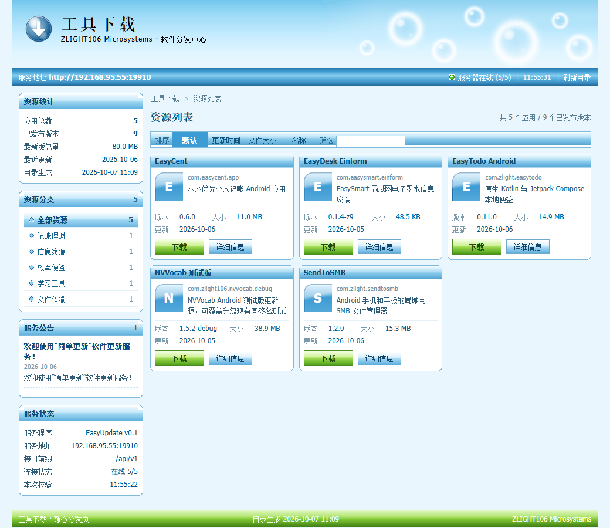
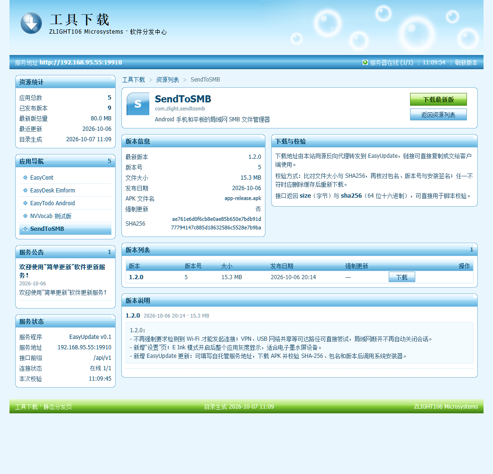

# 工具下载 · downloadpage

面向 [EasyUpdate](https://github.com/zlight-GA106/Easyupdate) 自托管更新服务的静态下载站。
页面标题为「工具下载」，不加载任何前端框架，兼容 IE6；
布局参照超微（Supermicro）IPMI 后台，皮肤为 Frutiger Aero / Web 2.0 高光风格。





---

## 目录

- [它是怎么跑起来的](#它是怎么跑起来的)
- [部署](#部署)
  - [前提](#前提)
  - [路径 A：直接部署已构建好的站点](#路径-a直接部署已构建好的站点)
  - [路径 B：从源码重新构建再部署](#路径-b从源码重新构建再部署)
  - [配置项](#配置项)
  - [不用脚本的手工部署](#不用脚本的手工部署)
- [日常更新](#日常更新)
- [排错](#排错)
- [目录结构](#目录结构)
- [IE6 兼容说明](#ie6-兼容说明)
- [许可](#许可)

---

## 它是怎么跑起来的

站点本身是纯静态文件，另加一条 nginx 反向代理：

```
                     ┌──────────────────────────────────────┐
   浏览器  ────────▶ │  nginx 容器 (tools-download-nginx)   │
   (含 IE6)          │                                      │
                     │  /            → 静态站点（只读挂载） │
                     │  /api/...     → EasyUpdate 服务      │
                     └──────────────────┬───────────────────┘
                                        │ proxy_pass
                                        ▼
                              EasyUpdate  http://<host>:19910
                              （应用清单、版本查询、APK 下载）
```

**同源代理是整个方案的关键。** IE6 的 `XMLHttpRequest` 不能跨域，把 `/api/` 代理到
EasyUpdate 之后，页面、接口、APK 下载全部同源：前端不需要任何跨域技巧，
下载按钮直接写相对路径 `/api/v1/apps/<包名>/releases/<版本号>/download` 就行，
大文件也能靠 nginx 边收边发地透传。

站点内容全部来自 EasyUpdate，本身不存任何数据。

---

## 部署

### 前提

| 项 | 要求 |
| --- | --- |
| 目标服务器 | Linux，已装 Docker，当前用户能执行 `docker` 命令 |
| EasyUpdate | 已部署并可从浏览器访问，记下它的地址（如 `http://192.168.1.100:19910`）和管理员账号 |
| 构建机 | Python 3.9+，`pip install paramiko pillow` |
| 网络 | 构建机能 SSH 到目标服务器，也能访问 EasyUpdate |

> 只需部署、不改内容的话，`pillow` 可以不装——它只用于重新生成皮肤位图。

### 路径 A：直接部署已构建好的站点

仓库里已经包含构建产物（`site/` 目录），克隆下来配好就能部署：

```powershell
git clone https://github.com/zlight-GA106/downloadpage.git
cd downloadpage

pip install paramiko

# 生成配置文件并填写
Copy-Item tools\deploy.env.example tools\deploy.env
notepad tools\deploy.env

# 部署
python tools\deploy.py
```

`deploy.py` 会依次做这些事，任何一步失败都会把远端输出原样打印出来：

1. 在服务器上创建 `DEPLOY_DIR`，把 `site/` 整个传上去；
2. 把 `deploy/nginx.conf` 里的 `{{EU_UPSTREAM}}` 换成你的 EasyUpdate 地址后上传；
3. `chmod -R a+rX` 修正权限（容器内 nginx 以 uid 101 运行，读不到就会 403）；
4. 只重建名为 `DEPLOY_CONTAINER` 的容器，映射 `SITE_PORT:80`，两个只读挂载；
5. 验证：容器状态、启动日志、容器内能否访问 EasyUpdate、宿主机能否取到页面与接口。

跑完会打印：

```
target: youruser@192.168.1.100:22  dir=/home/youruser/tools-download  container=tools-download-nginx  port=19911
uploaded 32 site file(s) + nginx.conf -> /home/youruser/tools-download
...
index.html 200 11879
api json 200 193
deployed: http://192.168.1.100:19911/
```

### 路径 B：从源码重新构建再部署

想抓取 EasyUpdate 上的最新应用清单、或改了页面样式时走这条：

```powershell
# 1. 从 EasyUpdate 后台抓取应用与版本元数据 -> build/catalog.json
python tools\harvest.py

# 2. 渲染静态页面 -> site/index.html, site/app-<id>.html, site/catalog.js
python tools\build_site.py

# 3.（可选）重新生成全部皮肤位图，仅在改视觉时需要，需要 pillow
python tools\make_assets.py

# 4. 部署
python tools\deploy.py
```

`harvest.py` 用的就是 `deploy.env` 里的 `EU_BASE` / `EU_USER` / `EU_PASS`，
它读取 EasyUpdate 后台页面来获得应用清单
（EasyUpdate 的公开接口只有「按包名查最新版本」和「下载」，没有「列出全部应用」）。

本地预览（起一个静态服务并把 `/api/` 代理到 EasyUpdate，行为与线上 nginx 一致）：

```powershell
python tools\devserver.py     # http://127.0.0.1:8099/
```

### 配置项

全部配置集中在 `tools/deploy.env`（已被 `.gitignore` 排除，**不要提交**）。
每个键都可以用同名环境变量覆盖，环境变量优先级更高。

| 键 | 示例 | 说明 |
| --- | --- | --- |
| `DEPLOY_HOST` | `192.168.1.100` | 目标服务器地址，必填 |
| `DEPLOY_USER` | `youruser` | SSH 用户，必填 |
| `DEPLOY_PASS` | `yourpassword` | SSH 密码；用密钥则留空 |
| `DEPLOY_KEY` | `C:\Users\you\.ssh\id_ed25519` | 私钥路径，`DEPLOY_PASS` 留空时使用 |
| `DEPLOY_PORT` | `22` | SSH 端口 |
| `DEPLOY_DIR` | `/home/youruser/tools-download` | 宿主机目录，会被挂载进容器 |
| `DEPLOY_CONTAINER` | `tools-download-nginx` | 本项目占用的容器名 |
| `DEPLOY_IMAGE` | `nginx:alpine` | 容器镜像 |
| `SITE_PORT` | `19911` | 站点对外端口 |
| `EU_BASE` | `http://192.168.1.100:19910` | EasyUpdate 地址（构建机视角） |
| `EU_UPSTREAM` | `192.168.1.100:19910` | 同一个服务，容器视角；写进 nginx 的 `proxy_pass` |
| `EU_USER` / `EU_PASS` | `admin` / `admin` | EasyUpdate 后台账号，仅 `harvest.py` 使用 |
| `DEV_PORT` | `8099` | 本地预览端口 |

### 不用脚本的手工部署

脚本只是把下面几步自动化了，理解这几步对排错很有用。

**1. 上传文件到服务器**

```bash
mkdir -p /home/youruser/tools-download
# 把仓库的 site/ 整个传上去
scp -r site youruser@192.168.1.100:/home/youruser/tools-download/
chmod -R a+rX /home/youruser/tools-download
```

**2. 准备 nginx 配置**

把 `deploy/nginx.conf` 传到 `/home/youruser/tools-download/nginx.conf`，
并把里面的 `{{EU_UPSTREAM}}` 替换成你的 EasyUpdate 地址（形如 `192.168.1.100:19910`，
不要带 `http://`，模板里已经有了）。最终关键片段：

```nginx
server {
    listen 80;
    root   /usr/share/nginx/html;
    index  index.html;

    charset       utf-8;
    charset_types text/css text/plain text/xml application/javascript application/json;

    gzip on; gzip_vary on; gzip_min_length 512;
    gzip_types text/css text/plain application/javascript application/json;

    expires -1;                       # 一律重新校验，重新发布后立刻可见

    location /api/ {
        proxy_pass         http://192.168.1.100:19910;
        proxy_http_version 1.1;
        proxy_set_header   Connection "";
        proxy_set_header   X-Real-IP $remote_addr;
        proxy_buffering    off;        # APK 可达 40 MB 以上，不落盘缓冲
        proxy_read_timeout 1800s;
        proxy_send_timeout 1800s;
        gzip off;
    }

    location / { try_files $uri $uri/ =404; }
}
```

**3. 起容器**

```bash
docker run -d --name tools-download-nginx --restart unless-stopped \
  -p 19911:80 \
  -v /home/youruser/tools-download/site:/usr/share/nginx/html:ro \
  -v /home/youruser/tools-download/nginx.conf:/etc/nginx/conf.d/default.conf:ro \
  nginx:alpine
```

两个挂载都是只读的：容器不写站点目录，改文件后重启容器即可生效。

**4. 验证**

```bash
docker ps --filter name=tools-download-nginx
docker exec tools-download-nginx nginx -t
docker exec tools-download-nginx wget -qO- http://192.168.1.100:19910/api/v1/announcements
curl -I http://127.0.0.1:19911/
```

---

## 日常更新

| 改了什么 | 需要跑 |
| --- | --- |
| EasyUpdate 上新增/下架了应用 | `harvest.py` → `build_site.py` → `deploy.py` |
| 新增了应用图标（`site/icons/`） | `build_site.py` → `deploy.py` |
| 改了页面、样式、脚本 | `build_site.py` → `deploy.py` |
| 改了皮肤位图 | `make_assets.py` → `build_site.py` → `deploy.py` |
| 只改了 `deploy/nginx.conf` 或部署参数 | `deploy.py` |

版本号、文件大小、发布日期这些**不需要重新构建**：页面载入后会对每个应用调用
`/api/v1/apps/<包名>/latest?version_code=0`，用接口返回值就地刷新卡片，
版本号变化时卡片右上角显示「更新」角标。

核对本地与线上是否一致（按 SHA256 逐文件比对，能分辨「服务器缺失 / 服务器多余 / 内容不同」）：

```powershell
python tools\verify_sync.py
```

**应用图标**：把 48x48 的图标按包名放进 `site/icons/`，构建时自动识别，
命中就用它替换默认的字母底板：

```
site/icons/com.easycent.app.png
site/icons/com.zlight.sendtosmb.ico
```

查找顺序 `png → gif → ico → jpg → jpeg`，构建日志会列出命中的包名
（`auto-detected icons: com.easycent.app`）。优先用 PNG/GIF——IE6 不能在 ``
里渲染 `.ico`，虽然构建认 `.ico`，但在 IE6 里它会回退成字母底板，现代浏览器正常。
图标加载失败时也会自动回退，不会留下破图。

---

## 排错

| 现象 | 原因与处理 |
| --- | --- |
| 页面能开，但图片全是 403 | 站点目录权限不对或目录缺执行位。跑 `chmod -R a+rX <DEPLOY_DIR>`。**不要**用 `chmod 644 dir/*`——通配符会连带命中子目录并抹掉其执行位，反而制造 403 |
| 重新发布后看到的还是旧页面 | 本项目响应头是 `Cache-Control: no-cache`，正常刷新即可。若浏览器里存有更早的长缓存版本，按一次 `Ctrl+F5` |
| 容器起来就退出 | 看 `docker logs <容器名>`；多半是 nginx 配置语法错，用 `docker exec ... nginx -t` 定位 |
| `proxy_pass` 里还留着 `{{EU_UPSTREAM}}` | 手工部署时忘了替换。用 `deploy.py` 会自动替换 |
| 容器内访问不到 EasyUpdate | `EU_UPSTREAM` 写成了容器不可达的地址（如 `127.0.0.1`）。容器里要写宿主机的**局域网 IP**，用 `docker exec <容器名> wget -qO- http://<地址>/api/v1/announcements` 验证 |
| APK 下载中断或很慢 | nginx 需要 `proxy_buffering off` 与足够长的 `proxy_read_timeout`，见上面的配置片段 |
| 端口被占用 | 改 `SITE_PORT`。部署前可用 `ss -ltn \| grep :<端口>` 确认空闲 |
| `missing configuration: DEPLOY_HOST` | 忘了 `Copy-Item tools\deploy.env.example tools\deploy.env`，或键名拼错 |

---

## 目录结构

```
site/                     部署到容器 /usr/share/nginx/html 的静态站点（已构建，可直接部署）
  index.html              资源列表：三栏卡片网格 + 排序 + 关键字筛选
  app-<id>.html           每个应用的详情页，下载在这里完成
  style.css               IE6 可识别子集样式表，@charset "utf-8"
  app.js                  ES3 客户端脚本（实时版本校验 / 排序 / 筛选）
  catalog.js              目录数据（纯 ASCII \uXXXX 转义，构建生成）
  favicon.ico
  images/                 19 个 GIF 条带 + 透明底 PNG 图标
  icons/                  可选的每应用图标，按包名自动识别
deploy/nginx.conf         容器内 /etc/nginx/conf.d/default.conf，含 {{EU_UPSTREAM}} 占位符
docs/                     README 用截图
tools/config.py           读取 deploy.env / 环境变量
tools/deploy.env.example  配置模板，复制成 deploy.env 后填写
tools/harvest.py          登录 EasyUpdate 后台抓取应用与版本 -> build/catalog.json
tools/make_assets.py      用 Pillow 生成全部皮肤位图与图标
tools/build_site.py       渲染 index.html、app-<id>.html 与 catalog.js
tools/deploy.py           上传并用 nginx 容器发布
tools/devserver.py        本地预览（静态目录 + /api/ 代理，等价于线上 nginx）
tools/sshrun.py           SSH/SFTP 小工具
tools/verify_sync.py      本地与线上逐文件比对
build/                    中间产物（catalog.json、截图等），不入库
```

### 页面功能

- **资源列表**：三栏卡片网格展示全部应用，每张卡片含图标、包名、简介、
  版本/大小/更新日期，以及「下载」（直接取最新版）和「详细信息」。
  左侧为资源统计、分类筛选、服务公告、服务状态；工具条支持按默认/更新时间/文件大小/名称
  排序与关键字筛选。排序与筛选由 `app.js` 重排同一份卡片标记，静态 HTML 里也有完整卡片，
  所以**关闭脚本时页面照常可用**。
- **应用详情页**：版本信息（最新版本、版本号、大小、发布日期、APK 文件名、强制更新、
  SHA256）、版本列表（每个历史版本一个下载按钮）、逐版本说明、下载与校验说明。
  左侧换成应用导航，可直接跳到别的应用详情页。

---

## IE6 兼容说明

页面按 IE6（JScript 5.6 / IE6 标准模式）编写，实际遵守的边界：

| 方面 | 采用 | 未采用 |
| --- | --- | --- |
| 文档 | HTML 4.01 Transitional + 完整 DTD（IE6 标准模式） | HTML5、XHTML 自闭合标签 |
| 布局 | `table` + `table-layout: fixed`，**全站零浮动** | flex/grid、`float` |
| 渐变/高光 | 1px 宽 GIF 位图 `repeat-x` 平铺 | CSS 渐变、`border-radius`、`box-shadow` |
| 圆角 | 9x9 圆角遮罩 GIF，绝对定位到四角 | `border-radius` |
| 透明度 | 条带用 GIF；图标用 PNG-8 + 单一全透明调色板索引（tRNS） | alpha 通道 PNG、`rgba()`、`opacity` |
| 悬停 | 仅 `<a>` 上的 `:hover` | 非 a 元素的 `:hover`、`transition` |
| 脚本 | ES3 语法，`ActiveXObject("Msxml2.XMLHTTP")` | `JSON`、`addEventListener`、`Array#forEach`、模板字符串、尾逗号 |
| 数据 | 目录烘焙成 JS 对象字面量；接口响应用自带迷你 JSON 解析器 | `JSON.parse`、`fetch` |

零浮动是刻意的：绕开 IE6 的浮动 / peekaboo / 重复字符 bug 家族。
图标用 PNG-8 的 tRNS 透明索引而不是 alpha 通道，因为 IE6 会把 alpha PNG 画成灰底方框；
代价是轮廓为硬边，因此图标外圈做成贴近背景色的浅色亮边，让锯齿落在低对比区域。

---

## 许可

[GPL-3.0](LICENSE)，与 EasyUpdate 保持一致。
